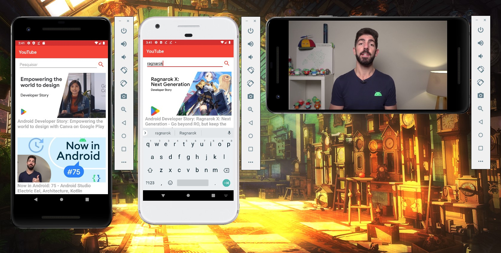

# YouTube Clone
ø

A basic YouTube Clone project, integrated with YouTube API for fetching Android Developers channel videos.

### Developers: 
* [Marcos Vinicius Ferreira](https://github.com/marcosnaofazisso) 

## Goals and Rules:
The main goals of a YouTube Clone project on Android development was to study how to replicate the functionality of playing videos fetched from YouTube API. This include the ability of fetching data, listing in a Recycler View, show thumbnails as well as playing selected videos on fullscreen mode with YouTube classes and interface.

The project aim to replicate the usability of YouTube listing and playing videos. 

# Demo

Images of some of the functionalities like listing and playing videos from YouTube channel Android Developers.

# Tutorial
Recommended build tools and SDK versions:

Android Studio IDE: 3.5
Android 8.0 / 9.0
Compile 26
Min SDK 15
Max Android SDK Build-Tools 28 (API 9)

Dependencies:

    //YouTube Android Player library
    implementation files("libs/YouTubeAndroidPlayerApi.jar")

    implementation 'androidx.appcompat:appcompat:1.0.0'
    implementation 'androidx.constraintlayout:constraintlayout:1.1.3'
    testImplementation 'junit:junit:4.12'
    androidTestImplementation 'androidx.test.ext:junit:1.1.1'
    androidTestImplementation 'androidx.test.espresso:espresso-core:3.1.0'
    implementation 'androidx.recyclerview:recyclerview:1.0.0'

    //Material Search View dependencies
    implementation 'com.miguelcatalan:materialsearchview:1.4.0'

    //Retrofit and Gson converter dependencies
    implementation 'com.squareup.retrofit2:retrofit:2.4.0'
    implementation 'com.squareup.retrofit2:converter-gson:2.4.0'

    //Picasso dependencies
    implementation 'com.squareup.picasso:picasso:2.71828'

## Thank you!

